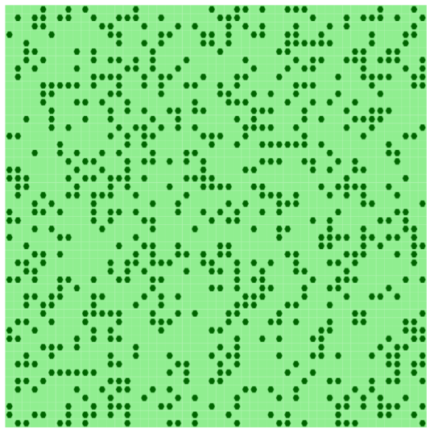
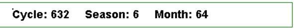

"Report: *Project 6 -* **Pasture and Forest**"
==============

**Author:***Nguyễn Đăng Minh -- M23.ICT.008*

# Introduction

## Context

The interaction between grazing herds and forest ecosystems is a
critical issue in the management of pasturelands, particularly when the
dominant tree species in the area is susceptible to grazing pressures.
This project focuses on the simulation of the grazing behavior of
shepherds managing herds of Logo goats in a forest with Cormasis gama
trees as the dominant species. These trees form distinct groves within
the pasture, providing higher nutritional value for the goats when
grazed in the forest. However, the grazing activities of the goats lead
to the degradation of these groves, turning forested areas into
pastureland.

## Objectives

- Simulate the behavior of shepherds / herds in the forest and pasture,
  focusing on the decision-making process influenced by factors such as
  forest size, food availability, the shepherd's perception,.... on the
  Cormasis gama groves.

- Assess how shepherds' individual attitudes toward the Forest
  Department regulations affect forest degradation.

- Determine the minimum probability of respectful behavior among
  shepherds that is required to maintain a sustainable forest cover and
  prevent total deforestation.

# Agents 

For this simulation model, we defined 2 agents to simulate this topic.

1.  **[Grid-based lands]{.smallcaps}**

In this simulation model, the forest ecosystem is represented by a 2D
grid of size **grid_size** x **grid_size**. The grid consists of cells
where a certain percentage, denoted as **forest_cover**%, is populated
by Cormasis gama trees. These trees are the primary food source for the
Logo goats, and their growth and spread are governed by the interactions
within the grid.

The probability of the forest expanding into a pasture cell is
calculated as a function of the number of neighboring forest cells and
the range defined by **max_spread** and **min_spread**:

N~forest~​ is the count of shared-edge neighboring cells that are
currently forested.

## Herd dynamics

- Herds move around the grid based on **perception_range** and available
  unoccupied lands by an another herds.

- Herds prefer forested cells but can settle in pasture lands if no
  forest is visible.

- Herds graze the grove cell into pasture cell.

# Extension

## Extension 1

**What would be the future of such a socio-ecosystem:**

if all shepherds were to enter the forest without any regulation

1.  **Simulation tracking**

To fully simulate a grazing season, we track the passage of both months
and seasons. This time-tracking mechanism enables us to update reflexes
more slowly based on changes in month and season, allowing for a more
realistic simulation of seasonal dynamics in the grazing
process.

Figure 3: Dashboard to keep track of cycles, seasons and months.

2.  Land cells

To create more realistic and insightful scenarios, each forested land
cell is assigned a density attribute. Density represents the health of
the grove cell and influences the potential for forest spread. When the
forest spreads, new forest cells inherit an average density value based
on their neighboring cells.

Additionally, a growth reflex is applied to the density of forested
cells. This updates monthly, with each grove tree\'s density increasing
by a **regen_rate**, but capped at a maximum value of 1.0 to prevent it
from growing indefinitely.

Figure 4: Different density for different groves.

3.  Herds/Shepherds

**Movement Dynamics**  
Herds are now accompanied by shepherds, who guide their movement within
a defined **perception range**. At the beginning of each month,
shepherds relocate to a new position within their perception range.
During the month, herds move around the perception range of the
shepherd\'s starting location. This simulates the localized grazing
behavior within a grazing season.

**Eating Activity**  
Herds actively graze on forested cells, reducing the density of the
grove by an amount equal to their **eating capacity** during each cycle.
If the density of a grove cell becomes too low, it transitions into
pastureland. Herds prioritize their movement based on the following
rules:

1.  **Remain on a grove cell:** Herds stay in place to graze if they are
    already on a forested cell.

2.  **Forested cells:** If not on a grove, herds move to nearby forested
    cell.

3.  **Pastureland:** If no forested cells are available, herds move to
    pastureland.

**Virtual Cues for Tracking Movement**  
To visualize the movement of herds and shepherds throughout a grazing
season, virtual cues are added to the simulation:

- **Black Lines:** Indicate the movement of shepherds between months.

- **Red Lines:** Represent the movement of herds within the perception
  range of the shepherds during each month.

Figure 5: Black Perception range indicate herds have no regulation in
protecting forest.

## Extension 2

**What would be the future of such a socio-ecosystem:**

if all shepherds were to follow their idea about the minimum size?

1.  Shepherds/ Herds behaviors.

Herds now rely on the memory of past months to refine their movement and
grazing behavior:

- At the end of each month, each shepherd calculates a
  **"self-authorized minimum size"** indicator.

- This indicator is determined as the **average density of all the
  land** visible to the shepherd on the last day of the month. Then that
  is **average self-authorized minimum size** of each month on the
  current season.

> When the next grazing season begins, these individual memories are
> reset, ensuring that grazing decisions are based on updated seasonal
> conditions.

Herds are **prohibited** from grazing on any grove where the density
falls below this threshold.

Figure 6 : Yellow Perception range indicate herds follow its own
**self-authorized minimum size**.

## Extension 3

**What would be the future of such a socio-ecosystem:**

What if all shepherds were to follow the Forest Department\'s
regulations?

1.  Institutional Minimum Size Calculation

At the end of each grazing season, the Forest Department determines an
**institutional authorized minimum size**:

- This is calculated as the **average of self-authorized minimum sizes**
  reported by shepherds at the end of the season.

- Groves with a density below this institutional minimum size are marked
  as **"protected"** for the upcoming grazing season.

Figure 7: Red grove indicate that grove is protected in this grazing
season.

1.  Respectful vs. Disrespectful Shepherds

Each shepherd is assigned a **"respectful"** attribute, based on a
probability parameter:

- **Respectful Shepherds**:

  - Avoid grazing on groves marked as **protected**.

  - Refrain from grazing on forests smaller than their individual
    **self-authorized minimum size**.

- **Disrespectful Shepherds**:

  - Ignore the institutional regulations and **protected groves**.

  - Only avoid grazing on forests smaller than their individual
    **self-authorized minimum size**. (The last extension)

Figure 8. Orange Perception range indicate herds avoid protected groves.

# Experiments

## parameters

These are the **default parameters** used across all experiments, except
for those explicitly modified for individual experiments.

- **Cycles per month:** 10

(The number of simulation cycles that occur within a single month.)

- **Months per grazing season:** 10

(The total number of months in one grazing season.)

- **Last grazing season:** 50

(The maximum number of grazing seasons simulated before the experiment
ends.)

- **Grid size:** 50

(The size of the 2D simulation grid, represented as a square of 50x50
cells.)

- **Forest cover fraction:** 0.3

(The percentage of grid cells initially covered by grove.)

- **Minimum tree spread probability:** 0.0025

(The lowest probability of grove spreading to adjacent cells per month.)

- **Maximum tree spread probability:** 0.02

(The highest probability of grove spreading to adjacent cells per month)

- **Forest regeneration rate:** 0.03

(The monthly rate at which forest density regenerates, capped at 1.0.)

- **Number of herds:** 25

(The total number of herds simulated within the environment.)

- **Perception range (m):** 4.5

(The radius within which shepherds can perceive and decide on movement
and grazing.)

- **Food per cycle:** 0.14

(The amount of forest density consumed by each herds per cycle when
grazing.)

- **Probability of being respectful:** Variable

(The likelihood that a shepherd will respect institutional regulations.)

- **Regulation mode:** true

(Indicates whether any regulations are enforced in the simulation.)

For each experiment we have a GUI version and the batch version.

GUI have the display of the simulation and 2 chart track the percentage
of grid cells covered by grove and the total density of the forest in
pie chart and time series chart. 

Figure 9. GUI simulations

In a **batch experiment**, we run the simulation multiple times with
different random seeds to account for variability and ensure robust
conclusions. The results of all runs are compiled into a CSV file, where
each row corresponds to a single simulation run. Key metrics are
recorded for comparison and analysis.

**Example Results**

| **Simulation Name** | **Respectful Rate** | **Deforestation Status** | **Last Seasons** | **Percentage of Groves** | **Total Biomasses** | **Sustainability** |
|---------------------|---------------------|--------------------------|------------------|--------------------------|---------------------|--------------------|
| Simulation 3        | 0.0                 | false                    | 51               | 0.0176                   | 33.18               | false              |

## No Regulation. {#no-regulation.}

- **Regulation mode**: false

All simulations resulted in **true** deforestation, indicating that
without any respect for forest regulations, the forest ecosystem cannot
sustain itself. By the end of each simulation, the percentage of groves
and total biomass dropped to **0.0**, signifying a complete loss of
forest cover

and biomass.

Figure 10. Chart showing the season that when the percentage of groves
dropped to **0.0**

On average, if all shepherds were to enter the forest without any
regulation, the whole forest would be destroyed at season 10.42.

Figure 11. Total deforestation

## Self-Regulation. {#self-regulation.}

- **Regulation mode:** false

- **Probability of being respectful:** 0.0

When shepherds operate under **self-regulation** without adhering to
external institutional rules, the outcomes reveal persistent
deforestation and an inability to achieve sustainability.

- All simulations reached the maximum grazing duration of **51
  seasons**, suggesting that forest patches persisted but were
  insufficient to restore a viable ecosystem.

- **The Percentage of Groves** at the end of the simulations ranged from
  **0.0112 (1.12%)** to **0.0956 (9.56%)**, reflecting significant
  forest depletion.

- **Total Biomass** exhibited considerable variability, from a low of
  **15.56** to a high of **175.32**,

- Despite some groves persisting, all simulations concluded with false
  sustainability, indicating that self-regulation alone is insufficient
  for long-term forest preservation. 

Figure 12. This shows the percentage of grove in the forest, and compare
to the sustainable line 0.3

Figure 13. There is a little bit of groves left\...

## Institutional-Regulation. {#institutional-regulation.}

- **Regulation mode:** false

- **Probability of being respectful:** 0.0

When shepherds follow institutional rules and respect protected groves,
the simulation results reveal a marked improvement in forest
sustainability and overall ecosystem health.

- Every simulation reaches the maximum grazing duration of **51
  seasons**, suggesting that forests remain viable over the long term
  under institutional regulation.

- **The Percentage of Groves** ranges from **0.2836 (28.36%)** to
  **0.4964 (49.64%)**, showing a significant retention of forest cover
  compared to self-regulation alone.

- **Total Biomass** values range from **531.26** to **1051.38**.

- Most simulations (18 out of 20) conclude with **true** sustainability,
  meaning the system achieves a balance between grazing and forest
  regeneration.

Figure 14. Most simulations achieve sustainability.

Figure 15. Achieve sustainability.

## Explore Respectful rate

To explore the minimum respectful percentage of shepherds required to
achieve sustainable grazing, we can define an experiment where we
systematically vary the \"Respectful Rate\" parameter in these
parameters setting, from 0.0 to 1.0 in steps of 0.1, and repeat the
simulation 5 times for each value.

For each set of simulations, we will track whether sustainability is
achieved, indicated by the \"Sustainability\" column in the results.

There is a positive correlation between the percentage of groves and the
respectful rate. As the respectful rate increases, the percentage of
groves tends to increase as well.

To determine the minimum respectful percentage required for
sustainability, we observe the following:

- **Simulations with Respectful Rate 0.0 to 0.4** consistently fail to
  achieve sustainability.

- **Simulations with Respectful Rate 0.5 to 0.7** show a mixed result,
  but some do achieve sustainability.

- **At Respectful Rate 0.8 and higher**: Most simulations achieve
  sustainability.

Figure 16. Average Percentage of groves by Respectful Rate

It appears that **a respectful rate of around 0.5 to 0.6** may be a
threshold for achieving sustainability in grazing. However, **higher
rates of 0.8 or more** lead to more consistent sustainability, with a
majority of simulations reaching sustainable grazing outcomes.
